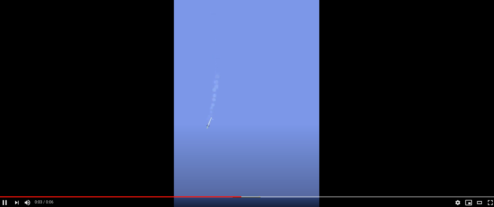

# SpaceX Falcon 9 Landing with Reinforcement Learning 

# 

The Falcon 9, developed by aerospace company SpaceX, means it is now possible to reuse the first-stage of the rocket, by flying it safely back to Earth.

An achievement once seemed so impossible that it lead creation of multiple “fake SpaceX landing videos-explanations” now is widely agreed upon about how amazing behind the tech related to it.

While today I’m not here nor capable of you giving rocket engineering course just wanted to show this quick little diagram from SpaceX to understand a little bit more.

Environment is created by [Sven Niederberger](https://github.com/EmbersArc) and it's based on LunarLander environment by OpenAI.

 

It offers you to include or exclude Velocity information for your Agent's Observation. 

You can either train in **DISCRETE ACTION**  or **CONTINUOUS ACTION** modes.
You can find more information at (gym/env/box2d/rocket_lander.py)

### STATE VARIABLES  
The state consists of the following variables:
  * X position  
  * Y position  
  * Angle  
  * First Leg Ground Contact Indicator  
  * Second Leg Ground Contact Indicator  
  * Throttle  
  * Engine Gimbal  
  
If VEL_STATE is set to true, the velocities are included:  
  * X velocity  
  * Y velocity  
  * Angular Velocity  
  
All state variables are normalized for improved training.
    

## Discrete control inputs are:
* Gimbal Left
* Gimbal Right
* Throttle Up
* Throttle Down
* Use First Control Thruster
* Use Second Control Thruster
* No Action
## Continuous control inputs are:
* Gimbal (Left/Right)
* Throttle (Up/Down)
* Control Thruster (Left/Right)

Since this is repository includes a modified version of **OpenAI GYM** , I won't recommend to install with PIP.

You can basically struct your code to execute from this directory so your own installed GYM package wouldn't interfere with this project. 

There are also Google Colab Notebooks that's ready to train and can record videos & save your network modules into your Google Drive.
If you work on local machine you can basically skip Drive related commands.

There are 3 agents in this project.I left ***PPO*** as default. If you want to run ***D4PG*** or ***SAC*** algorithms just rename LIB folders correctly
(lib -> lib_PPO ,  libSAC-> lib  or libD4PG -> lib) you get the idea.

Agent creation done thanks to PTan library. You can find more information about it link below.

[PTan Agent Network Library](https://github.com/Shmuma/ptan)

If you have anyting to ask regarding to project or RL in general feel free to ask me via e-mail in my profile.
Have a nice flight !

## Tensorboard X 

In order to see logs of your train run , you can execute command below

tensorboard --logdir runs/ --host localhost

## Name of training run

Don't forget to change training run each time you execute code or otherwise it will overwrite of older files.
Also don't forget to change video_directory if you want to save videos.

## How to test 

I already saved bunch of network models in **/rocket_saved_networks/** folder.  You can try them out with play function ( feel free to edit if you have custom agents or if you try other networks you may need to load actor model etc.)

## Detailed Medium Post

https://medium.com/@paypaytr/spacex-falcon-9-landing-with-rl-7dde2374eb71
